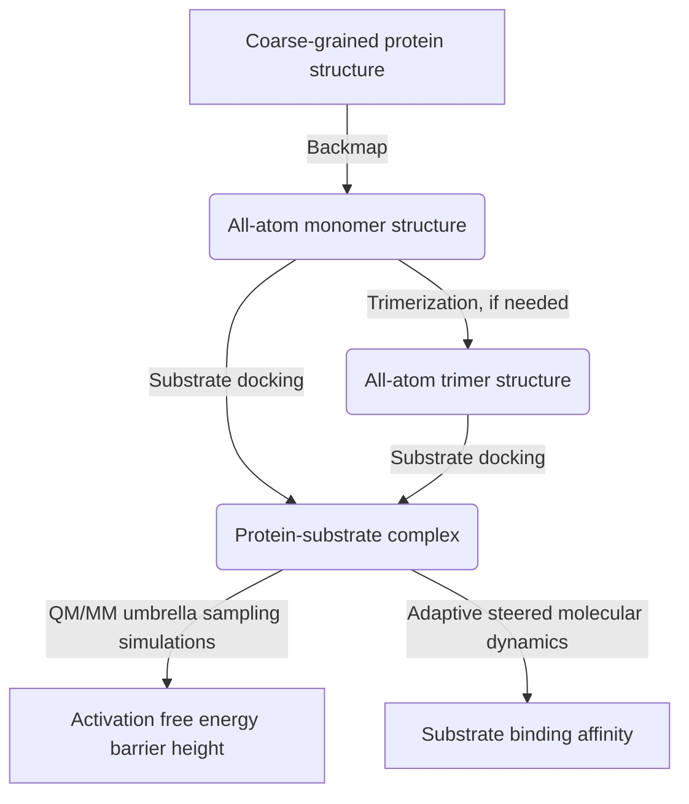

## Activation Energy Estimation Workflow

#### Author: [Dr. Yang Jiang](https://orcid.org/0000-0003-1100-9177)

This is a package of python (3.X) scripts that are used to estimate activation free energy, as well as the ligand binding affinity, for a protein structure obtained from a [coarse-grained (CG) simulation](https://git.psu.edu/obrien/yang_jiang/cg_simtk_protain_folding). All the scripts are ready to use when users have added the directories (including all the child folders) in `$PATH` (add `export PATH=${PATH}:/path/to/one/folder/` in your `~/.bashrc` file) and have granted the execution permission (`chmod -R +x ./act_ene_estimation/`) for all the scripts. 

:warning: The workflow requires additional softwares installed prior to use. Please click `Learn more` in the following script instruction tables to find detailed instruction of usage and basic theory used in the script.

### Table of Contents
  * [1. Introduction](#1-introduction)
  * [2. Trimerization](#2-trimerization)
  * [3. Substrate Docking](#3-substrate-docking)
  * [4. QM/MM Umbrella Sampling Simulations](#4-qmmm-umbrella-sampling-simulations)
  * [5. Adaptive Steered Molecular Dynamics Simulations](#5-adaptive-steered-molecular-dynamics-simulations)

### 1. Introduction
The workflow includes the following procedures as illustrated in Fig. 1: (1) Backmap from the coarse-grained structure to the all-atom structure; (2) Predict the trimer structure if needed; (3) Predict protein-substrate complex structure using substrate  docking; (4) Estimated activation free energy barrier height based on given reaction coordinates using QM/MM umbrella sampling simulations; (5) Estimate binding affinity using adaptive steered molecular dynamics simulations.

### 2. Trimerization

### 3. Substrate Docking

### 4. QM/MM Umbrella Sampling Simulations

### 5. Adaptive Steered Molecular Dynamics Simulations