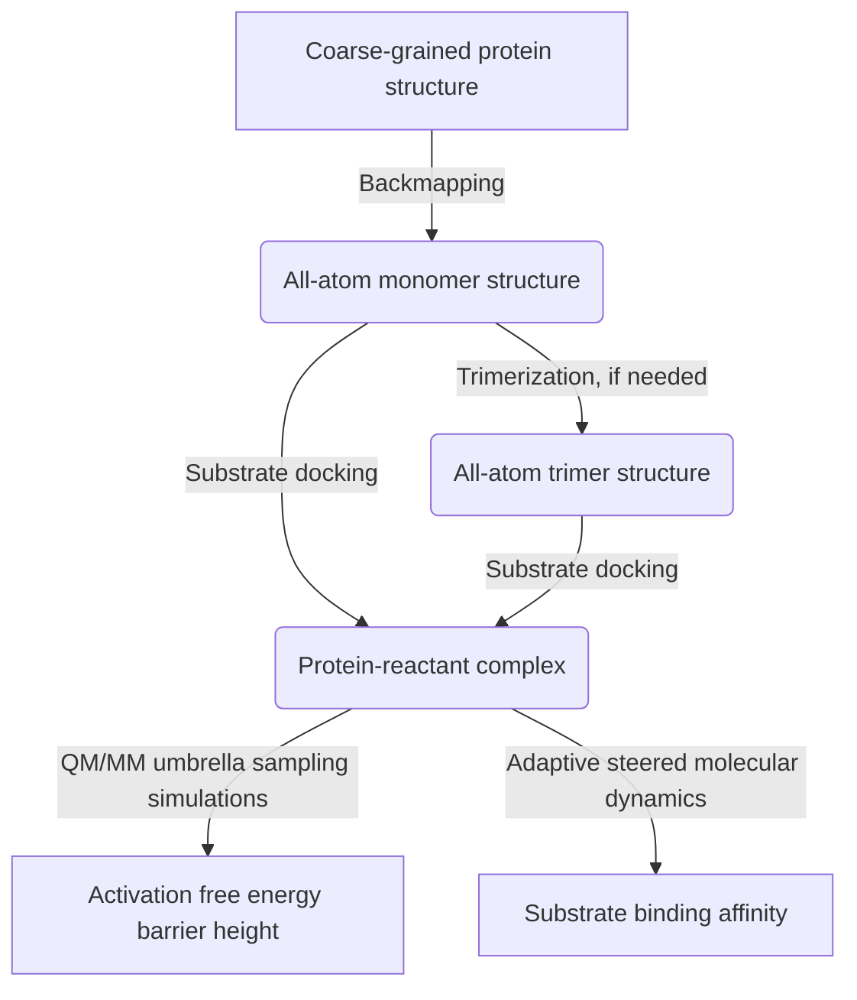

## Activation Energy Estimation Workflow

#### Author: [Dr. Yang Jiang](https://orcid.org/0000-0003-1100-9177)

This is a package of python (3.X) scripts that are used to estimate activation free energy, as well as the ligand binding affinity, for a protein structure obtained from a [coarse-grained (CG) simulation](../../../../cg_simtk_protain_folding). All the scripts are ready to use when users have added the directories (including all the child folders) in `$PATH` (add `export PATH=${PATH}:/path/to/one/folder/` in your `~/.bashrc` file) and have granted the execution permission (`chmod -R +x ./act_ene_estimation/`) for all the scripts. 

:warning: The workflow requires [`Amber (16+)`](http://ambermd.org/), [`Autodock vina`](http://vina.scripps.edu/), [`Autodock Tools`](http://autodock.scripps.edu/resources/adt), [`wham`](http://membrane.urmc.rochester.edu/?page_id=126), and [`SymmDock`](http://bioinfo3d.cs.tau.ac.il/SymmDock) installed prior to use. Please click `Learn more` in the following script instruction tables to find detailed instruction of usage and basic theory used in the script.

### Table of Contents
  * [1. Introduction](#1-introduction)
  * [2. Trimerization](#2-trimerization)
  * [3. Substrate Docking](#3-substrate-docking)
  * [4. QM/MM Umbrella Sampling Simulations](#4-qmmm-umbrella-sampling-simulations)
  * [5. Adaptive Steered Molecular Dynamics Simulations](#5-adaptive-steered-molecular-dynamics-simulations)

### 1. Introduction
- The workflow includes the following procedures as illustrated in Fig. 1: (1) [Backmap](../../../../cg_simtk_protain_folding#6-backmapping-from-coarse-grained-model-to-all-atom-model) from the coarse-grained structure to the all-atom structure; (2) Predict the trimer structure if needed; (3) Predict protein-reactant complex structure using substrate docking; (4) Estimated activation free energy barrier height based on given reaction coordinates using QM/MM umbrella sampling simulations; (5) Estimate binding affinity using adaptive steered molecular dynamics simulations.

**Figure 1**. Workflow diagram

- To run the workflow, use `auto_backmap_docking_us_smd.py` ([Learn more](../../wikis/help_wiki/auto_backmap_docking_us_smd.py)). You can also run one of the above steps by using the corresponding script. [:leftwards_arrow_with_hook:](#table-of-contents)

### 2. Trimerization
- In some special cases, a monomer protein does not have the enzymatic activity. For example, type III Chloramphenicol acetyltransferase ([CAT-III](https://www.uniprot.org/uniprot/P00484#interaction)), which is an effector of chloramphenicol resistance in bacteria, is a homotrimer and constructs its substrate binding pocket by the residues from two monomers. The multimer structure is essential to use when we study the substrate binding and enzymatic activity. In this workflow, we only implemented the procedure for predicting the trimer structure of CAT-III. Users need to modify the source code to implement other multimer predictions.
- Script to be used in this section:

| Script | Instructions |
| ------ | ------ |
| docking/**trimerization.py** | Predict the trimer structure by using the all-atom monomer structure for CAT-III. Need to get the `Amber` (16+) and `SymmDock` installed prior to use. ([Learn more](../../wikis/help_wiki/trimerization.py)) |

[:leftwards_arrow_with_hook:](#table-of-contents)

### 3. Substrate Docking
- In order to estimate the substrate binding and enzymatic activity, the protein-reactant complex structure must be predicted. For those proteins that have the crystal structure resolved for the protein-reactant complex, users can directly use that crystal structure. However, most of the proteins that we are interested in do not have the crystal complex structure resolved. Users need to use the scripts in this section to predict the protein-reactant complex structure.
- Scripts to be used in this section:

| Scripts | Instructions |
| ------ | ------ |
| docking/**docking.py** | Predict the protein-reactant complex structure by using the all-atom protein structure and the reactant binding information. Need to get the `Amber` (16+), `Autodock vina` and `Autodock Tools` installed prior to use. ([Learn more](../../wikis/help_wiki/docking.py)) |
| docking/**auto_backmap_docking.py** | An automated script to call `backmap.py` (found [here](https://git.psu.edu/obrien/yang_jiang/cg_simtk_protain_folding#6-backmapping-from-coarse-grained-model-to-all-atom-model)), `trimerization.py` and `docking.py`. ([Learn more](../../wikis/help_wiki/auto_backmap_docking.py)) |

[:leftwards_arrow_with_hook:](#table-of-contents)

### 4. QM/MM Umbrella Sampling Simulations
- In order to assess the enzymatic activity, the activation free energy barrier height ($`\Delta G^{\ddagger}`$) is the widely used parameter. $`\Delta G^{\ddagger}`$ can be estimated by using the umbrella sampling on the given reaction coordinates in conjunction with the QM/MM simulation technique. 
- Scripts to be used in this section:

| Scripts | Instructions |
| ------ | ------ |
| umbrella_sampling/**run_ess_us.py** | Run umbrella sampling on the given reaction coordinates in conjunction with the QM/MM simulation technique. Need to get `Amber` (16+) and `wham` installed prior to use. ([Learn more](../../wikis/help_wiki/run_ess_us.py)) |
| umbrella_sampling/**run_ess_us_restart.py** | Extend the umbrella sampling time. ([Learn more](../../wikis/help_wiki/run_ess_us_restart.py)) |

[:leftwards_arrow_with_hook:](#table-of-contents)

### 5. Adaptive Steered Molecular Dynamics Simulations
- In order to assess the substrate binding, the binding affinity ($`\Delta G_{\text{bind}}`$) is the widely used parameter. $`\Delta G_{\text{bind}}`$ can be estimated by using the adaptive steered molecular dynamics (ASMD) simulations. 
- Scripts to be used in this section:

| Scripts | Instructions |
| ------ | ------ |
| smd/**run_smd.py** | Run ASMD simulations for a given protein-reactant complex. Need to get `Amber` (16+) installed prior to use. ([Learn more](../../wikis/help_wiki/run_smd.py)) |

[:leftwards_arrow_with_hook:](#table-of-contents)
